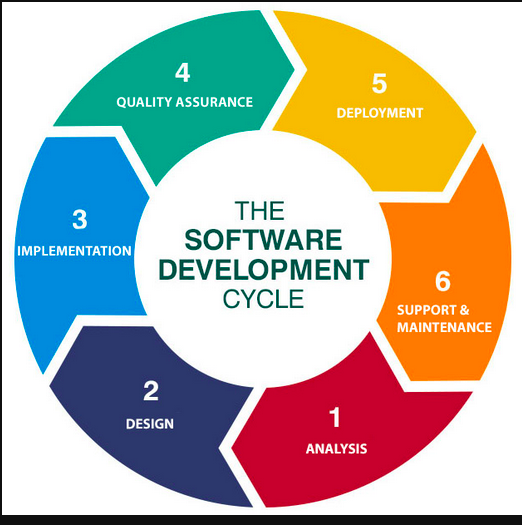
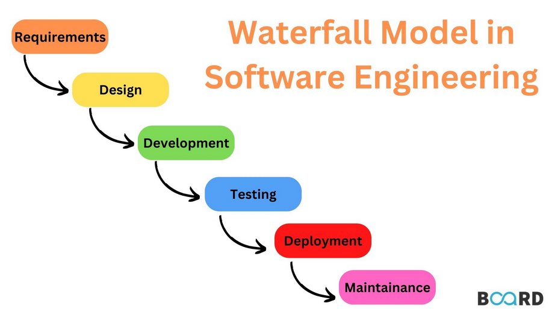
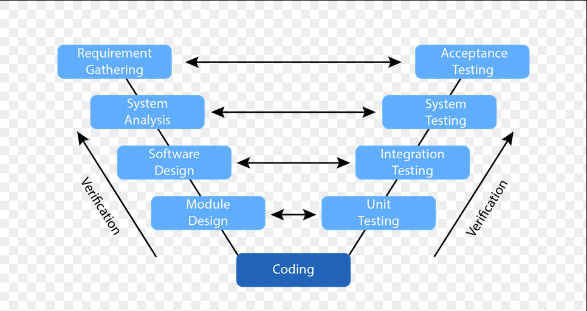
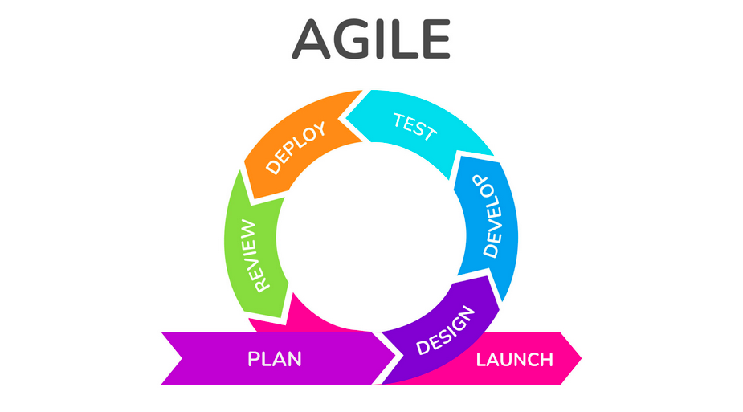

# Module 1 - Software Development LifeCycle SDLC

## What is Softeare Engineering?

### Objectives

* Define Software Engineering
* List the responsibilities of a software engineer
* Compare and contrast the role of software engineer to software developer

### Definition

    Software engineering is the application of scientific principles to the design and creation
    of software.
    The field uses a systematic approach to collect and analyze business requirements in order
    to design, build, and test software applications to satisfy those business requirements. 

    - Kedasha Kerr
        What is software engineering??

        - Using programming languages and engineering principles to build products
        - Software Engineering can be a broad term
        - Different types of engineers

        What is the difference between a software developer and a software engineer??

        - Trained as full stack developer but worked on front-end
        - May be a matter of semantics
        - Gatekeeping
        - Title changes and title differences
        - Depends on the particular company
        - All using same tools and technology
        
    - Liseidy Bueno
        What is software engineering??
    
        - Building and improving software
        - Design architecture to user interface to fixing bugs
    
        What is the difference between a software developer and a software engineer??

        - Sometimes terms are used interchangeably
        - Software engineers are responsible for system design and architecture
        - Software developers are focused more on building code
    
    - Tommy Young
        What is software engineering??

        - A creative process
        - Practice of designing, envisioning implementing, and then supporting and maintaining software through the full lifecycle
    
        What is the difference between a software developer and a software engineer??

        - Sofware engineer may be a broader term than developer
        - Development one part of the process
        - Software engineering starts before development
        
    - Diane Panagiotopoulos
        What is software engineering??
    
        - Software engineering, development, and programming can mean different things depending on who you ask

        What is the difference between a software developer and a software engineer??

        - Sometimes terms can mean very different roles
        - Software engineer can be similar to civil engineer or mechanical engineer
        - Titles can mean different roles in different countries

## Introduction to the SDLC (Software development life cycle)

### Goals

    - Systematic process to develop high-quality software
    - Aims to produce software that meets requirements
    - Defined phases with their own processes and deliverables
    - Cycle of planning, design, and development
    - Minimizes development risks and costs

### History of the SDLC

    - Conceived of in the mid-1960s
    - A deliberate approach needed to manage complex projects
    - Initially used the waterfall method
    - Adapted to use iterative methods

### Advantages of the SDLC
    
    - Improves efficiency and reduce risks
    - Team members know what they should be working on and when
    - Facilitates communication among stakeholders
    - Team members know when development can move to the next phase
    - Respond to changing requirements
    - Solve problems early in the process
    - Reduces overlapping responsibilities

### Recap

    - The SDLC provides a systematic process for software development
    - The SDLC developed because of a need for a systematic approach
    - SDLC Advantages include
        - Risk reduction and improved efficiency

## Phases of SDLC

### Phase 1 - Planning

- Gathered 
- Analyzed
- Documented
- Prioritized

#### Parts to be considered

- Users of the solution
- Purpose of the solution
- Data Inputs/Outputs
- Legal and Regulatory Compliance
- Risk Identifications
- QA requirements
- Allocating Human and Finantial Resources
- Project Scheduling 

#### Prototyping

- Small-scale replica to clarify requirements
- Test design ideas
- Can be developed at various stages of the SDLC

#### Software requirements specification (SRS)

- Requirements are documented in the SRS
- All stakeholders must agree

### Phase 2 - Design

- Requirements are gathered from the SRS to develop architecture.

- Build Design Document

### Phase 3 - Development

- After Design Document is produced, the project planners use this document to assign coding tasks

- Develop process can be done securely

### Phase 4 - Testing

- Code is tested to ensure stability, security, and that it meets requirements from the SRS

- Bugs reported, tracked, fixed, and retested until the code is stable

#### Test types included

- Unit testing

- Integration Testing

- System Testing 

- Acceptance Testing

### Phase 5 - Deployment

Tested Code -> User acceptance testing environment -> Production Environment

### Phase 6: Maintenance

- Other bugs
- New and changing requirements
- Code enhancements
- User interface issues

## Building Quality Software

### Common software engineering processes

- Requirements gathering
- Design
- Coding for quality
- Testing
- Releases
- Documenting

### Requirement Gathering

- The software requirements specification (SRS) encompasses the process of collecting and documenting the set of requirements that the software needs to adhere to.

- It may include a set of use cases that describe the business needs and user flows that the software must implement

SW requirements can be classified into four broad categories:

- Functional
- External & user interface
- System features
- Nonfunctional

### Design

- Transforming requirements into code
- Breaking down requiremtns into sets of realted components
- Communicating business rules and application logic

### Coding for quality

- Maintainability
- Readability
- Testability
- Security

Quality code mus fulfill the intended requirements of the software without defects

- Clean and consistent
- Easy to read and maintain
- Well documented
- Efficient

Coding for quality entails following a set of coding practices during development

- Following coding standards
- Using linters to detect errors
- Commenting in the code itself to make it easy to understand and modify

### Testing

The process of verifying that the software matches established requirements and is free of bugs

- Identify errors, gaps, or missing requirements;
- Ensures reliability, security, performance, and efficiency
- Software testing can often be automated or done manually

Types:

- Unit testing
- Integration testing
- System testing
- User acceptance testing (UAT) or Beta testing

### Releases

#### Alpha

- Select stakeholders
- May contain errors
- Preview of functioning version
- Design changes may occur

#### Beta

- All stakeholders
- User testing
- Meets requirements

#### GA (General Availability)

- Stable
- All users

### Documenting

- System documentation
    - README files, inline comments, architecture and design documents, verification information and maintenance;
- User documentation
    - User guides, instructional videos, manuals, online and inline help

## Requirements

### Steps to gathering requirements

- Identifying stakeholders
- Establishing goals and objectives
- Eliciting requirements from the stakeholders
- Documenting the requirements
- Analyzing and confirming the requirements
- Prioritizing

### Identifying stakeholders

- Key personnel:
    - Decision-makers
    - End-users
    - System administrators
    - Engineering
    - Marketing
    - Sales
    - Customer support

### Establishing goals and objectives

- Goals: broad, long-term achievable outcomes
- Objectives: actionable, measurable actions that achieve the goal

### Eliciting, documenting, confirming

- Elicit
    - Surveys
    - Questionnaires
    - Interviews
- Document
    - Align with goals and objectives
    - Easily understood
- Confirm
    - Consistency
    - Clarity
    - Completeness

### Prioritizing

- Must-have
- Highly desired
- Nice to have

### Requirements documentation

- Software requirements specification (SRS)
- User requirements specification (URS)
- System requirements specification (SysRS)

### Software requirements specification (SRS)

- Captures functionalities the software should perform
- Establishes benchmarks / service-levels for performance
- Purpose and scope
- Constraints, assumptions, dependencies
- Requirements
    - Functional
    - External interface
    - Systme features
    - Non-functional

### SRS: Purpose and scope

- Purpose
    - Who has access to the SRS
    - How it should be used
- Scope
    - Software benefits
    - Goals
    - Objectives

### SRS: Constraints, assumptions, dependencies

- Constraints: how the software must operate under given conditions
- Assumptions: required OS of hardware
- Dependencies: on other softaware products

### SRS: Requirements

- Functional: functions of the software
- External: users and interactions with other hardware or software
- System features: functions of the system
- Non-functional: performance, safety, security, quality

### User requirements specification (URS)

- Describe business need and end-user expectations
- User stories:
    - Who is the user?
    - What is the function that needs to be performed?
    - Why does the user want this functionality?
- Confirmed during user acceptance testing
- Often combined into the SRS

### System Requirement Specification (SysRS)

- Outlines requirements of the system
- Broader than an SRS
- Contains:
    - System capabilities
    - Interfaces and user characteristics
    - Policy
    - Regulation
    - Personnel
    - Security
    - System acceptance criteria
    - Hardware expectations

## Software Development Methodologies

### Common development methodologies

A process is needed to clarify communication and facilitate information sharing among team members.

Waterfall
V-shape model
Agile

#### Waterfall method

**Pros and Cons**

- Pros:
    - Team members understand their responsibilities due to discrete, well-defined stages
    - Easier to estimate budget and allocate resources
- Cons:
    - Lacks flexibility
    - Change is hard to accommodate

#### V-shape model

**Pros and Cons**

- Pros: 
    - Easy to use
    - Test plans designed upfront saves development and testing time
- Cons:
    - Rigid
    - Does not accommodate changing requirements

#### Agile

**Pros and Cons**

- Pros:
    - Changing requirements handled easily
    - Feedback incorporated regularly
- Cons:
    - Budgeting and resource allocating is challenging
    - Project Scope not clearly defined

## Software Versions

- Software Versions are identified by version numbers
- Version numbers indicate:
    - When the software was released
    - When is updated
    - If any minor changes or fixes were made to the Software
- Software developers use versioning to keep track of new Software, updates, and patches

### Version numbers

- Version numbers can be short or long, with 2, 3, or 4 sets
- Each number set is divided by a period
- An application with a 1.0 version number indicates the first release
- Software with many releases and updates will have a large number
- Some software use dates for versioning, such as Ubuntu Linux version 18.04.2 released in 2018 April, with a change shown in the third number set

### What do version numbers mean??

Some version numbers follow the semantic numbering system and have 4 parts separated by a period

- The first number indicates major changes to the software, such as a new release
- The second number indicates that minor changes were made to a piece of software
- The third number in the version number indicates patches or minor  bug fixes
- The fourth number indicates build numbers, build dates, and less significant changes

